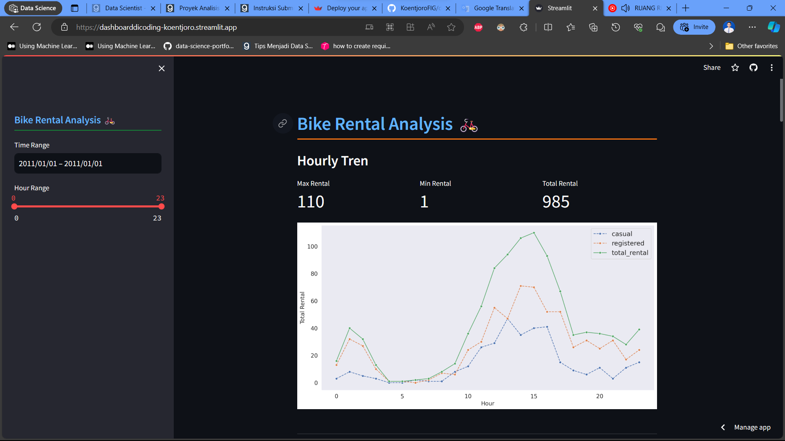
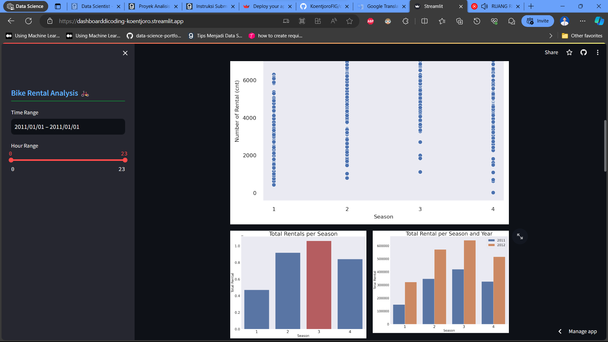
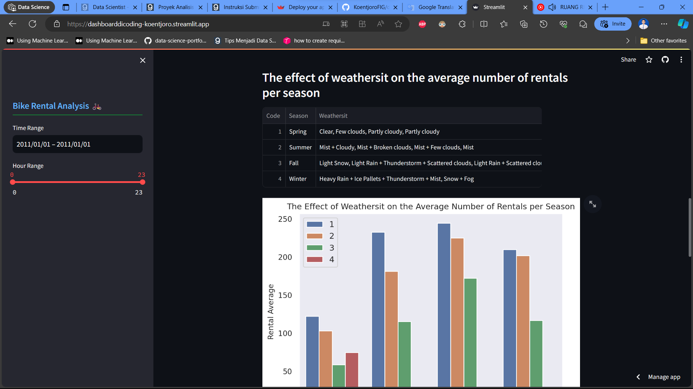
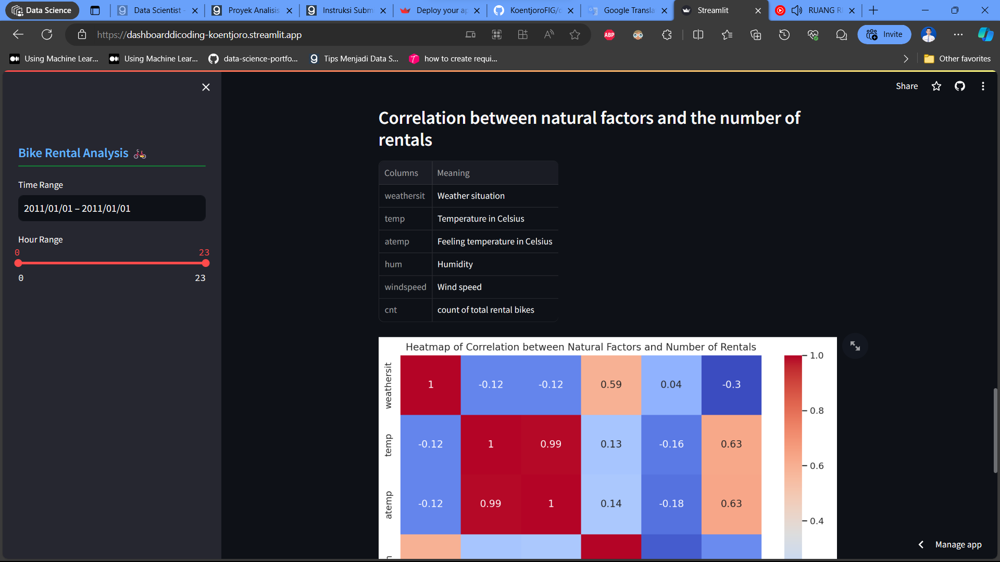
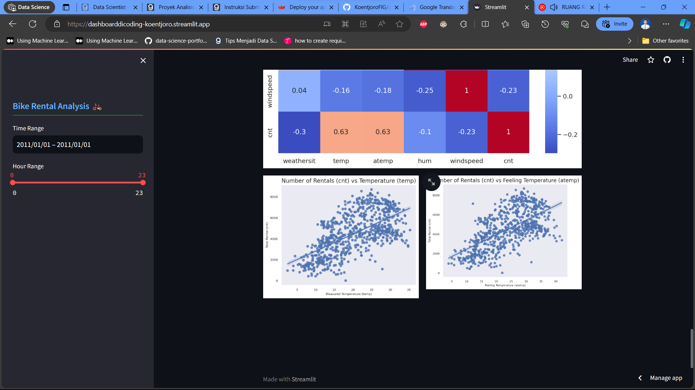

# Bike Rental Analysis 🚲

## Setup environment
```
conda create --name main-ds python=3.9
conda activate main-ds
pip install numpy pandas matplotlib seaborn jupyter streamlit
```

## Run steamlit app
```
streamlit run dashboard.py

## Link to My Dashboard
https://dashboarddicoding-koentjoro.streamlit.app/

## My Dashboard's Screenshot





